### Задача №1
https://hub.docker.com/repository/docker/mobicode/custom-nginx/general

### Задача №2
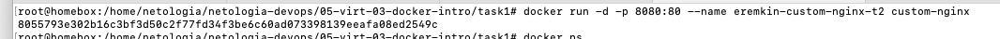

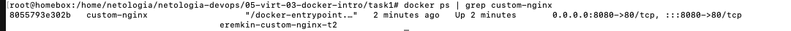

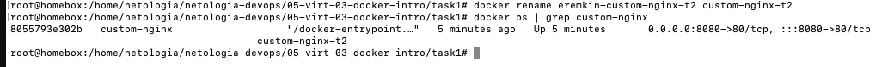

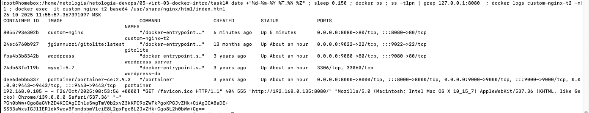

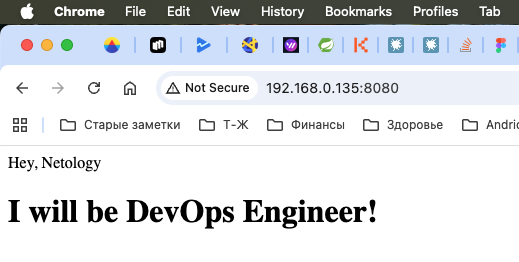

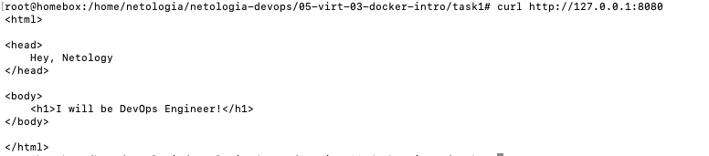

### Задача №3

```
docker attach custom-nginx
```
Контенер остановился, потому что с помощью attch мы подключились с основному процессу контейнера (pid 1) и при Ctrl+C мы его завершили.

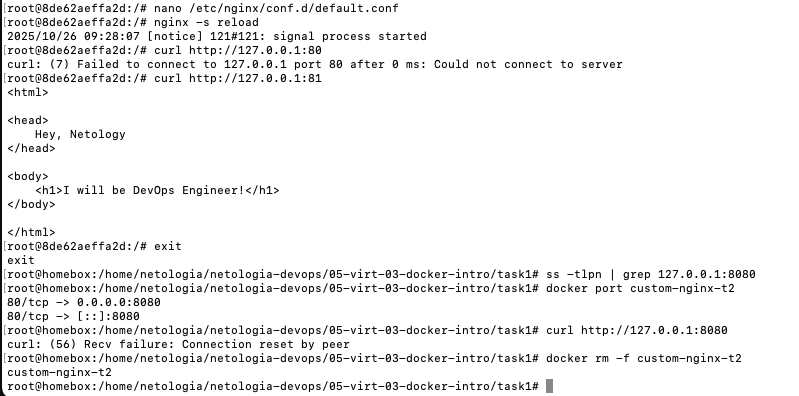

Внутри контейнера мы изменили порт с 80 на 81, на котором работает nginx, но настройки контейнера по мапингу портов 8080 -> 80 не поменялись, поэтому сервер ngix стал не доступен.

### Задача №4 

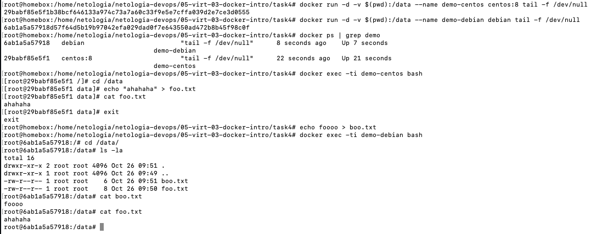

### Задача №5 

Docker compose поддерживает оба файла compose.yaml и docker-compose.yaml (для совместимости со старыми версиями), но будет запуска compose.yaml, если в каталоге находятся оба

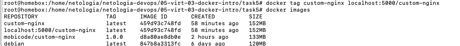

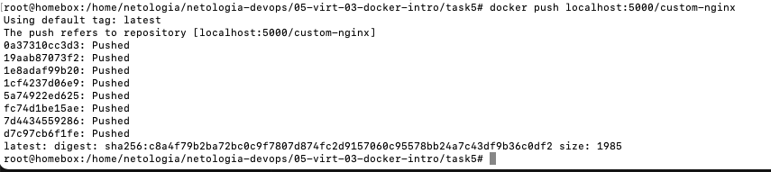

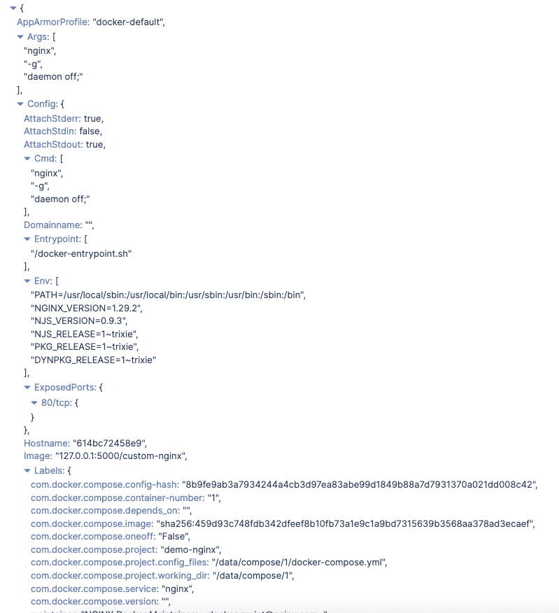

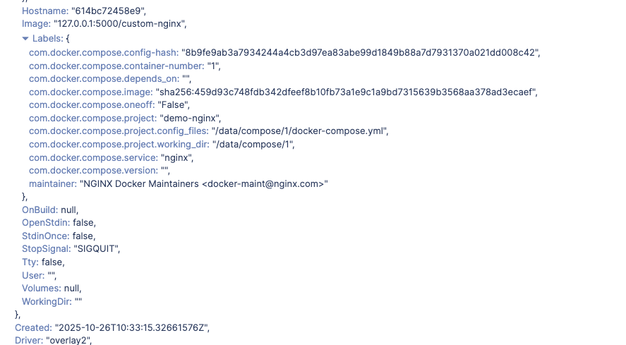

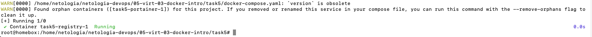

Предупреждение означает, что есть контейнеры которые были созданы через docker-compose файл, но о них нет упоминания, но они продолжают работать. Чтобы остановить их нужно выполнить команду
```
docker-compose down --remove-orphans
```

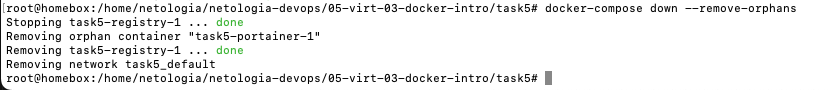

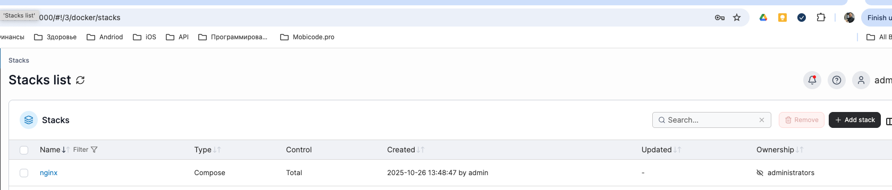

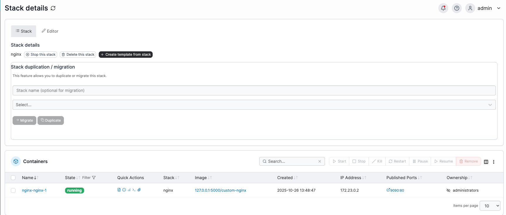