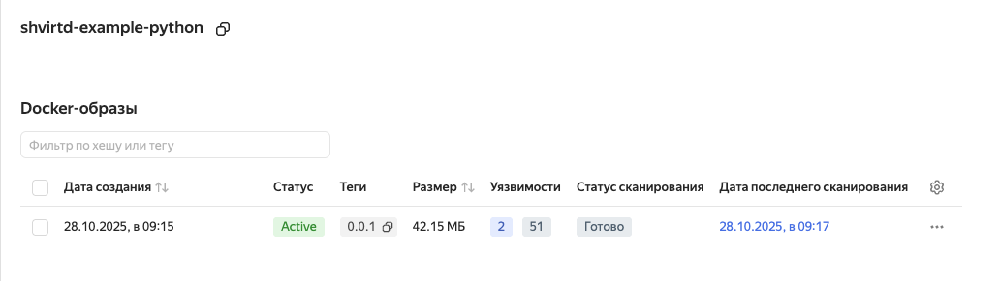
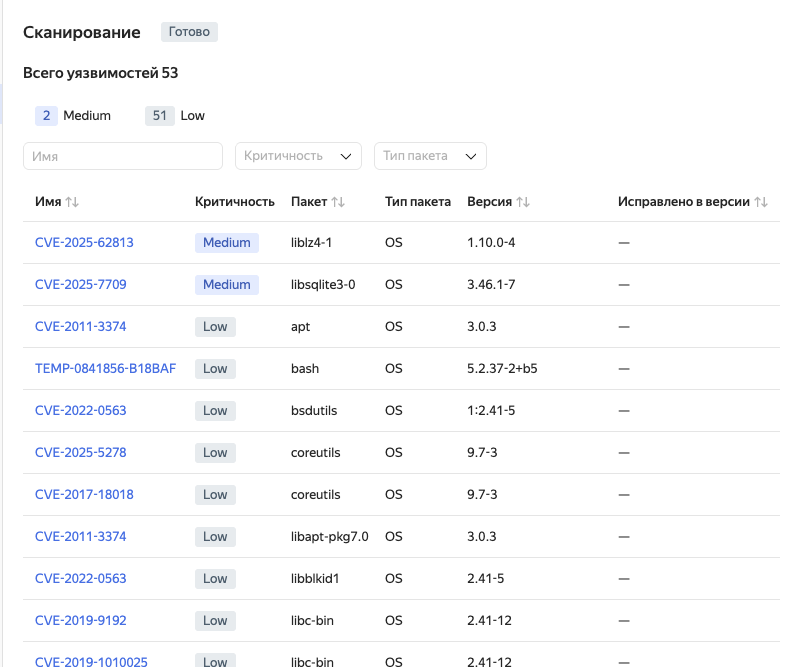
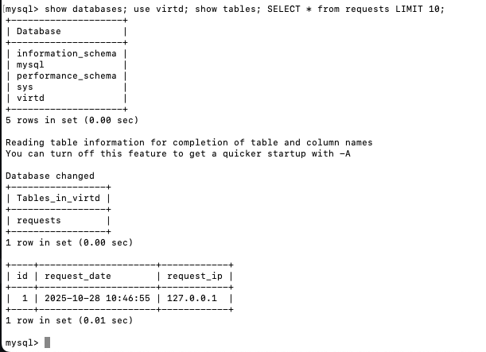
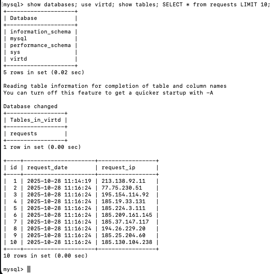
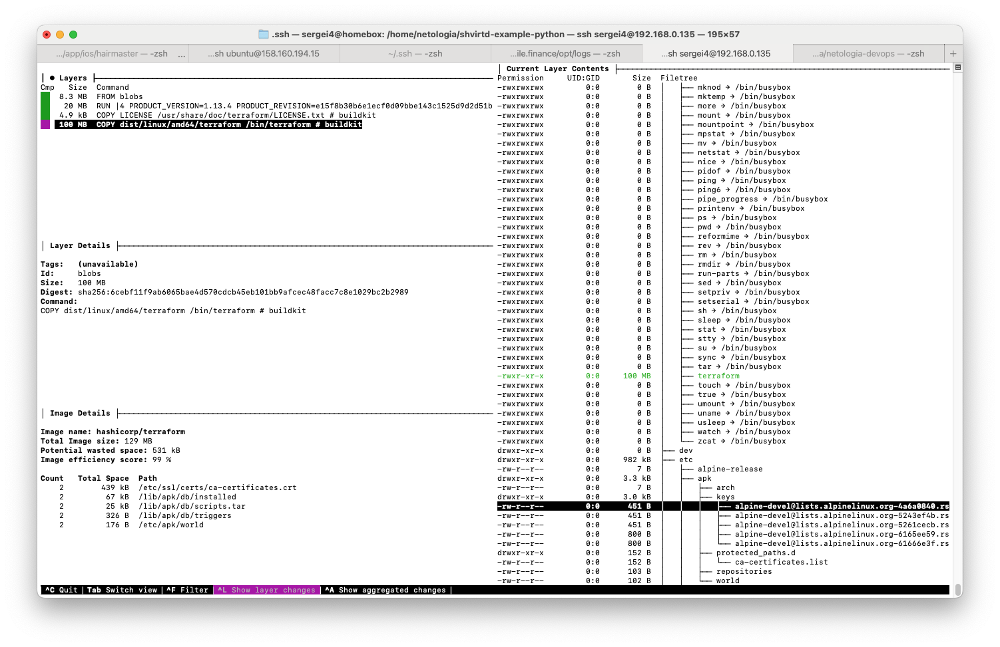
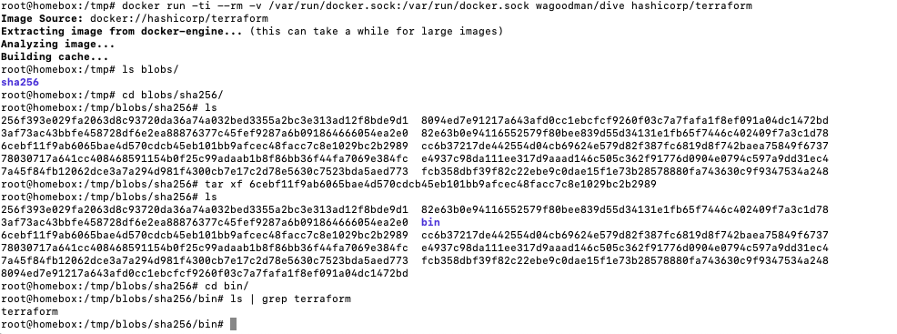
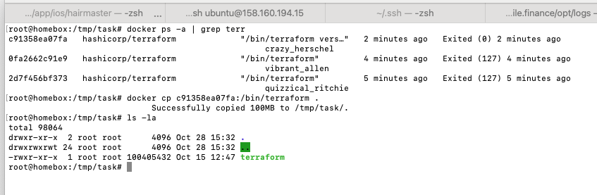

### Задача №1

fork: https://github.com/sergei4/shvirtd-example-python

.dockerignore
```
*
!main.py
!requirements.txt
```

### Задача №2





### Задача №3



### Задача №4



fork: https://github.com/sergei4/shvirtd-example-python

### Задача №6

с помощью dive и save





с помощью cp



