# Домашнее задание к занятию «Организация сети»

Установка Nat и Public VM

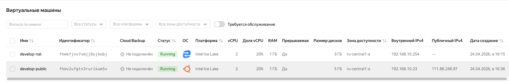

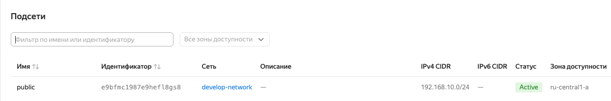

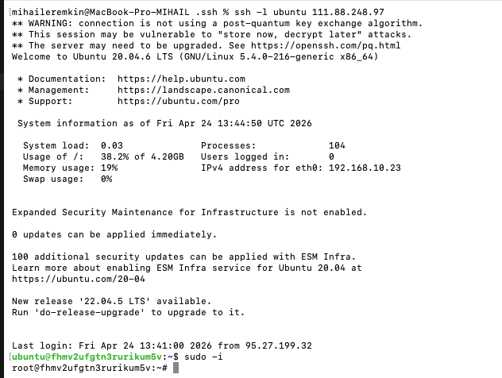

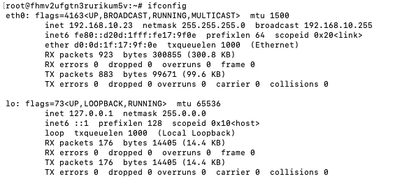

Доступ у Nat и Internet для Public VM

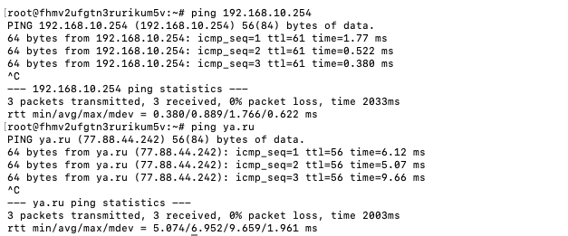

Установка Private VM

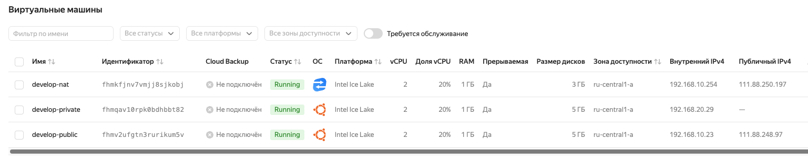

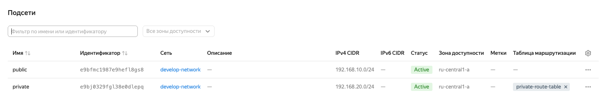

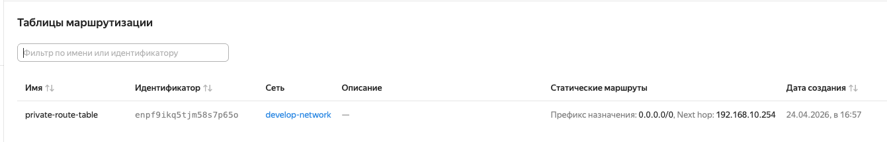

Ping с Public VM на Private VM

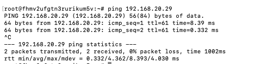

Настройка группы безопасности

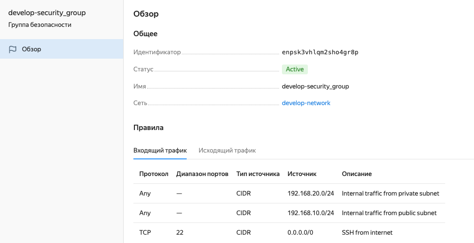


Подключение к Private VM через Public VM

```
ssh -i ~/.ssh/yc-ssh-key-1759848858263 -o ProxyCommand="ssh -i ~/.ssh/yc-ssh-key-1759848858263 -W %h:%p ubuntu@111.88.248.97" ubuntu@192.168.20.29
```

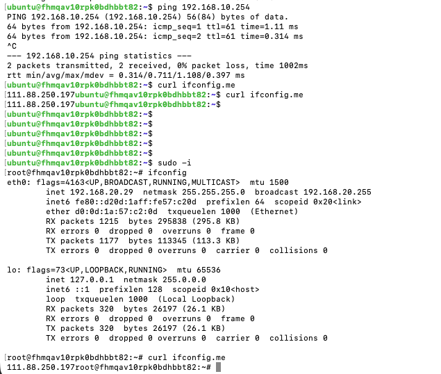

