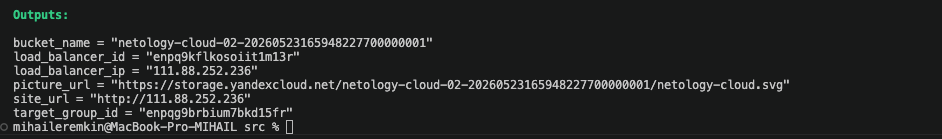
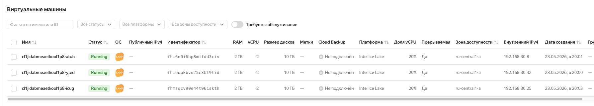
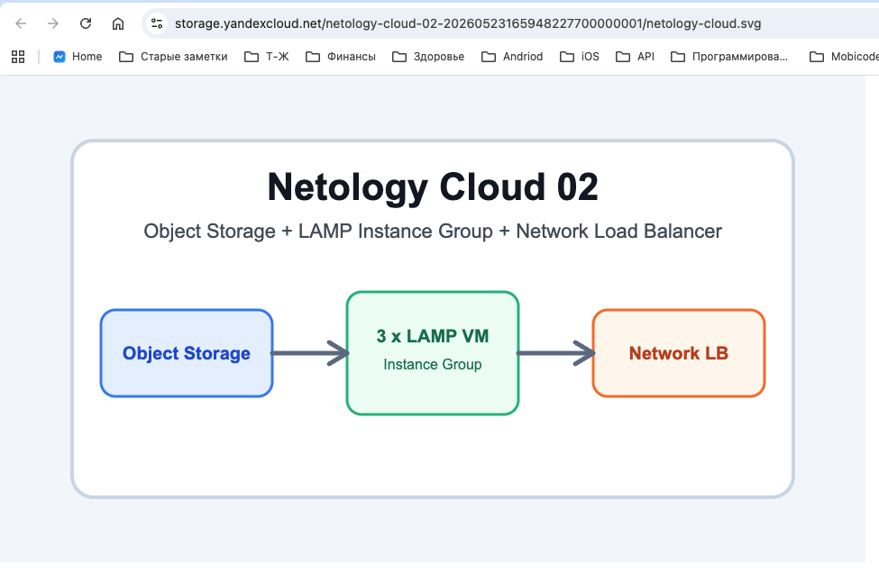
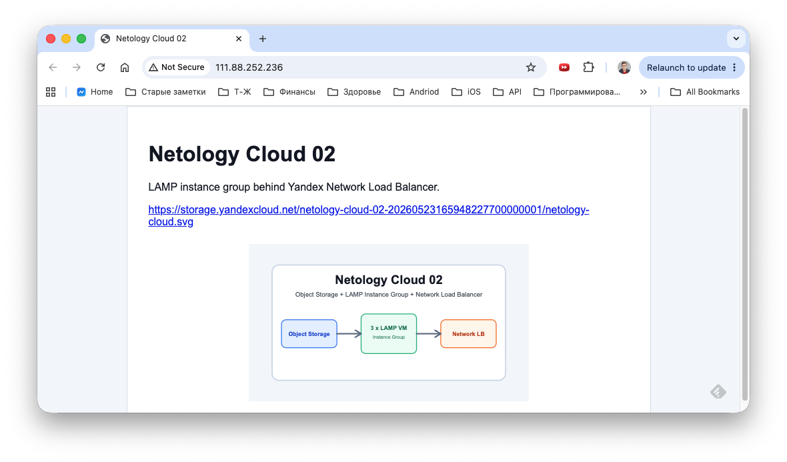
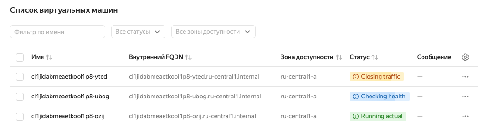
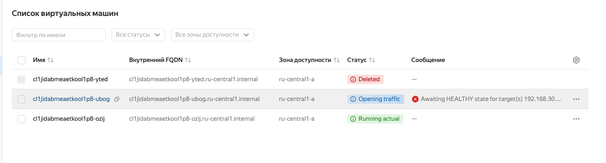

# Домашнее задание к занятию «Вычислительные мощности. Балансировщики нагрузки»

## Задание 1. Yandex Cloud

Запуск

```bash
cd cloud-02/src
terraform init
terraform validate
terraform plan
terraform apply
```










Проверка отказоустойчивости:






