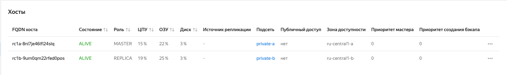
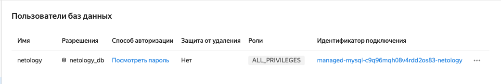
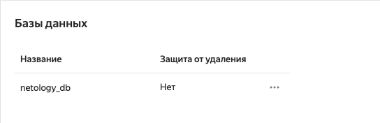
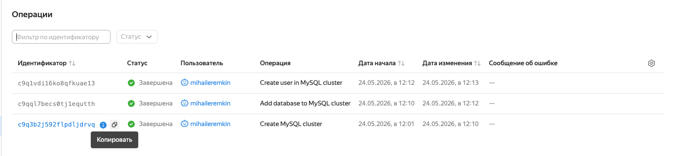
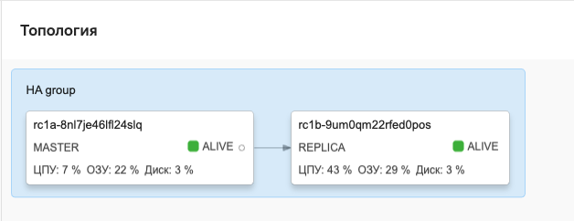
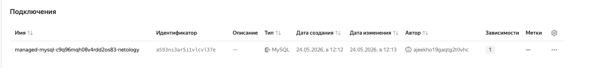

# Домашнее задание к занятию «Кластеры. Ресурсы под управлением облачных провайдеров»

## Задание 1.1. Yandex Cloud: кластер MySQL

Terraform-конфигурация находится в каталоге [src](src).

Запуск:

```bash
cd cloud-04/src
terraform init
terraform validate
terraform plan
terraform apply
```











