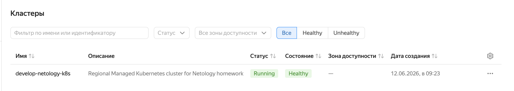
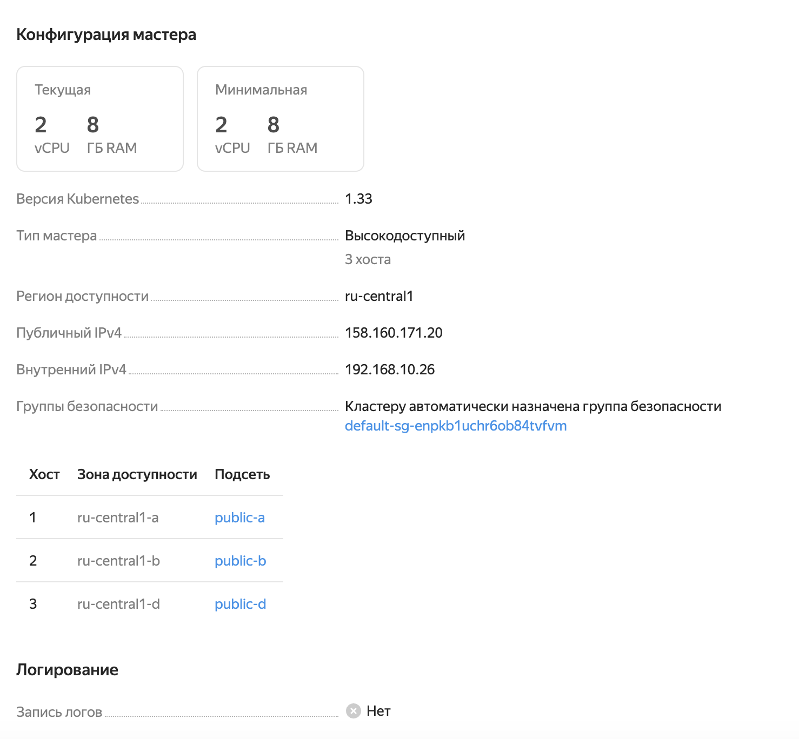
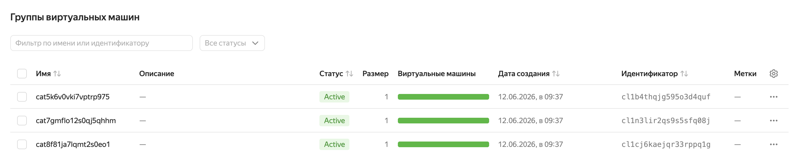
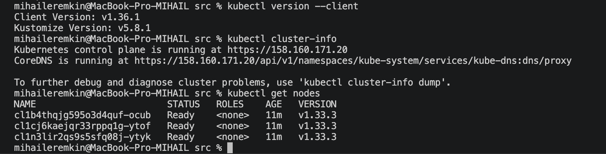
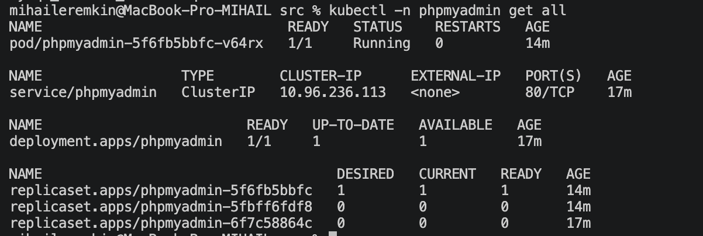
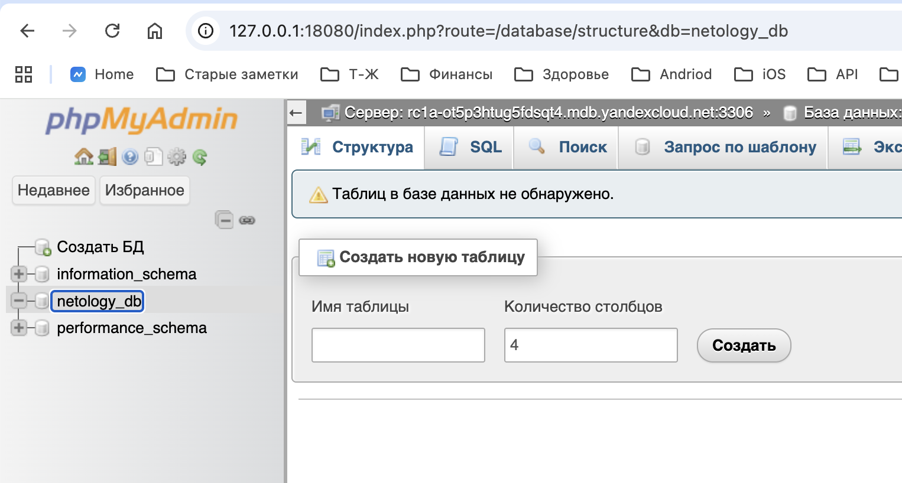

# Домашнее задание к занятию «Кластеры. Ресурсы под управлением облачных провайдеров»

## Задание 1.1. Yandex Cloud: кластер MySQL

Terraform-конфигурация находится в каталоге [src](src)

Запуск:

```bash
cd cloud-04/src
terraform init
terraform validate
terraform plan
terraform apply
```


## Задание 1.2. Yandex Cloud: кластер Kubernetes

Terraform-конфигурация находится в каталоге [src](src)









## Задание 1.2*. phpMyAdmin

```bash
kubectl -n phpmyadmin create secret generic phpmyadmin-secret --from-literal=PMA_PASSWORD="..."
```

Манифест phpMyAdmin находится в [k8s/phpmyadmin.yaml](k8s/phpmyadmin.yaml).


```bash
kubectl apply -f cloud-04/k8s/phpmyadmin.yaml
```

```bash
kubectl -n phpmyadmin get all
kubectl -n phpmyadmin port-forward service/phpmyadmin 18080:80
```





