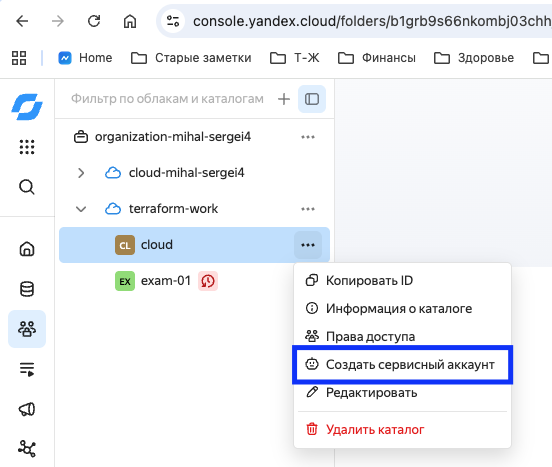
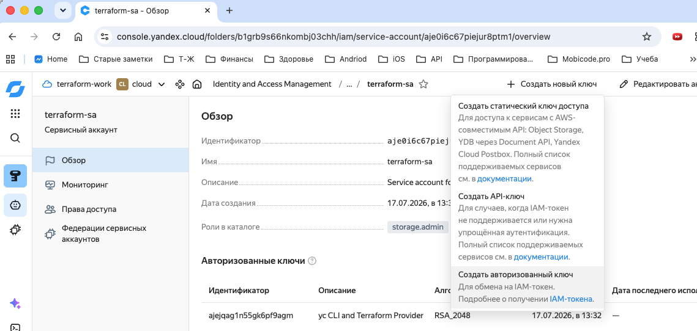
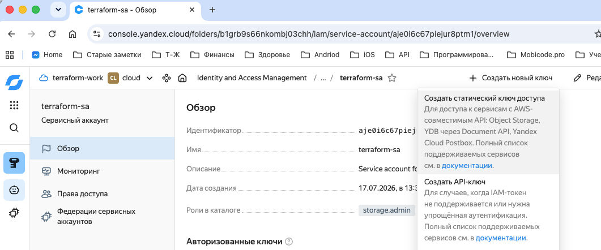
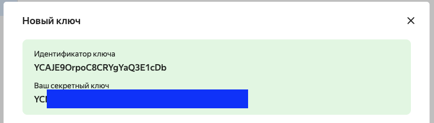
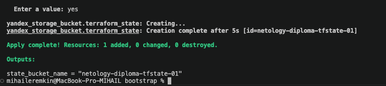

## Создание облачной инфраструктуры

Иструменты:
* terraform cli
* yc cli 

Создаем сервисный аккаунт `terraform-sa` в YC



| Роль | Для чего нужна |
|---|---|
| `vpc.admin` | Создание и удаление VPC, подсетей, таблиц маршрутизации, публичных адресов и групп безопасности |
| `storage.editor` | Чтение и запись Terraform state в Object Storage |
| `compute.admin` | Создание, изменение и удаление виртуальных машин, дисков и групп ВМ |
| `load-balancer.admin` | Создание Yandex Network Load Balancer |
| `alb.admin` | Создание Yandex Application Load Balancer |

Создаем ключ доступа IAM и копируем в папку ~/.config/yandex-cloud/keys/terraform-sa-key.json




Создаем ключ доступа для S3 backet





### Создание S3

Terratorm настройки в папке `bootstrap`

```bash
terraform init
terraform apply
```



### Создание инфраструктуры

Terratorm настройки в папке `infrastructure`

Создаем файл `backend.env` 
```
export AWS_ACCESS_KEY_ID="YC***"
export AWS_SECRET_ACCESS_KEY="YC***"
```
Активируем переменные в сеансе и подключаем backend
```bash
source ./backend.env
terraform init -backend-config=backend.hcl
```

Настраиваем инфраструктуру
```bash
terraform apply
```