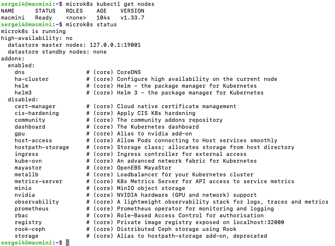
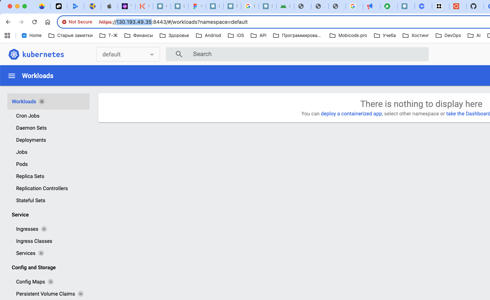

Установка и запуск mikrok8s

```
# Установка MicroK8S
sudo snap install microk8s --classic

# Добавление пользователя в группу microk8s
sudo usermod -a -G microk8s $USER
sudo chown -f -R $USER ~/.kube

# Применить изменения группы (перелогиниться или выполнить)
newgrp microk8s

# Проверка статуса
microk8s status --wait-ready
```

```
microk8s kubectl get nodes
```


Установка dashboard

```
microk8s kubectl apply -f https://raw.githubusercontent.com/kubernetes/dashboard/v2.7.0/aio/deploy/recommended.yaml

# добавляем IP если будет подключаться из вне 130.193.49.35
nano /var/snap/microk8s/current/certs/csr.conf.template
sudo microk8s refresh-certs --cert front-proxy-client.crt
```

Запускаем dashbord

```
# Создаем token 
microk8s kubectl create token default -n kube-system
microk8s kubectl port-forward -n kubernetes-dashboard service/kubernetes-dashboard 10443:443
```

Открываем в браузере https://130.193.49.35:10443




