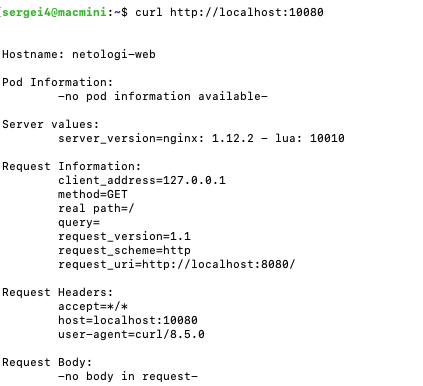
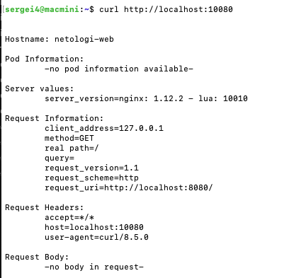

## Задача 1

``` yaml
apiVersion: v1
kind: Pod
metadata:
  name: netologi-web
spec:
  containers:
  - name: echoserver
    image: gcr.io/kubernetes-e2e-test-images/echoserver:2.2
    ports:
    - containerPort: 8080
```
``` bash
kubectl apply -f netology-web.yaml
```
``` bash
kubectl port-forward netologi-web 10080:8080
```



## Задача 2

``` yaml
apiVersion: v1
kind: Pod
metadata:
  name: netologi-web
  labels:
    app.kubernetes.io/name: echoserver
spec:
  containers:
  - name: echoserver
    image: gcr.io/kubernetes-e2e-test-images/echoserver:2.2
    ports:
    - containerPort: 8080
---
apiVersion: v1
kind: Service
metadata:
  name: netologi-web
spec:
  selector:
    app.kubernetes.io/name: echoserver
  ports:
    - protocol: TCP
      port: 80
      targetPort: 8080
```

``` bash
kubectl apply -f netology-web.yaml
```
``` bash
kubectl port-forward service/netologi-web 10080:80
```



