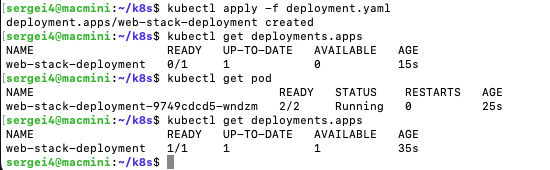
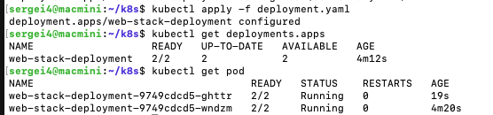
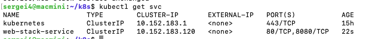
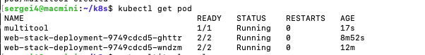
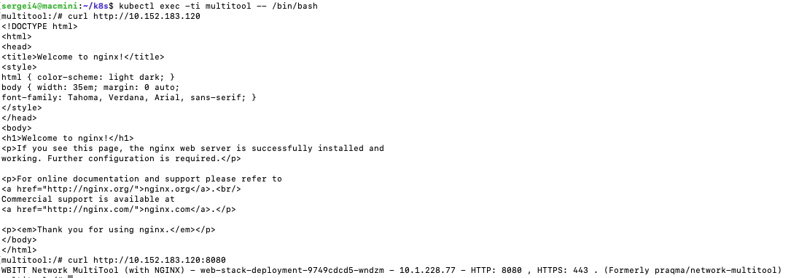
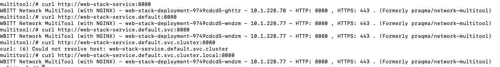
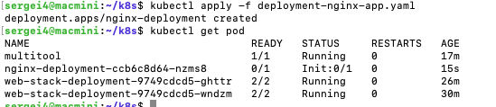
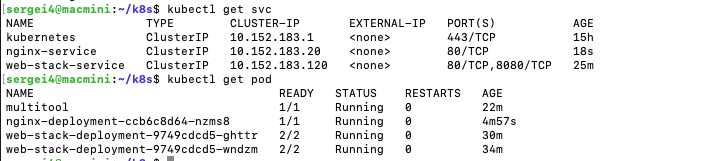

## Задача 1

``` yaml
apiVersion: apps/v1
kind: Deployment
metadata:
  name: web-stack-deployment
  labels:
    app: web-stack
spec:
  replicas: 1
  selector:
    matchLabels:
      app: web-stack-pod
  template:
    metadata:
      labels:
        app: web-stack-pod
    spec:
      containers:
        - name: nginx-container
          image: nginx:1.25
          ports:
            - containerPort: 80
              name: http

        - name: multitool-container
          image: wbitt/network-multitool
          env:
            - name: HTTP_PORT
              value: "8080"
          ports:
            - containerPort: 8080
              name: http-multitool
```


увеличение реплик до 2



``` yaml
apiVersion: v1
kind: Service
metadata:
  name: web-stack-service
spec:
  selector:
    app: web-stack-pod
  ports:
    - name: nginx-port
      protocol: TCP
      port: 80
      targetPort: 80
    - name: multitool-port
      protocol: TCP
      port: 8080
      targetPort: 8080
  type: ClusterIP
```


``` yaml
apiVersion: v1
kind: Pod
metadata:
  name: multitool
  labels:
    app.kubernetes.io/name: multitool
spec:
  containers:
  - name: multitool-container
    image: wbitt/network-multitool
    ports:
    - containerPort: 80
```
   

```bash
kubectl exec -ti multitool -- /bin/bash
```



через DNS



## Задача 2

``` yaml
apiVersion: apps/v1
kind: Deployment
metadata:
  name: nginx-deployment
  labels:
    app: nginx-app
spec:
  replicas: 1
  selector:
    matchLabels:
      app: nginx-pod
  template:
    metadata:
      labels:
        app: nginx-pod
    spec:
      initContainers:
        - name: busybox-init
          image: busybox
          command:
            - sh
            - -c
            - |
              until nslookup nginx-service.default.svc.cluster.local; do
                echo "Waiting for nginx-service...";
                sleep 2;
              done;
              echo "Service found! Starting main container."

      containers:
        - name: nginx-container
          image: nginx:1.25
          ports:
            - containerPort: 80
              name: http
```



``` yaml
apiVersion: v1
kind: Service
metadata:
  name: nginx-service
spec:
  selector:
    app: nginx-pod
  ports:
    - name: http
      protocol: TCP
      port: 80
      targetPort: 80
  type: ClusterIP
```

