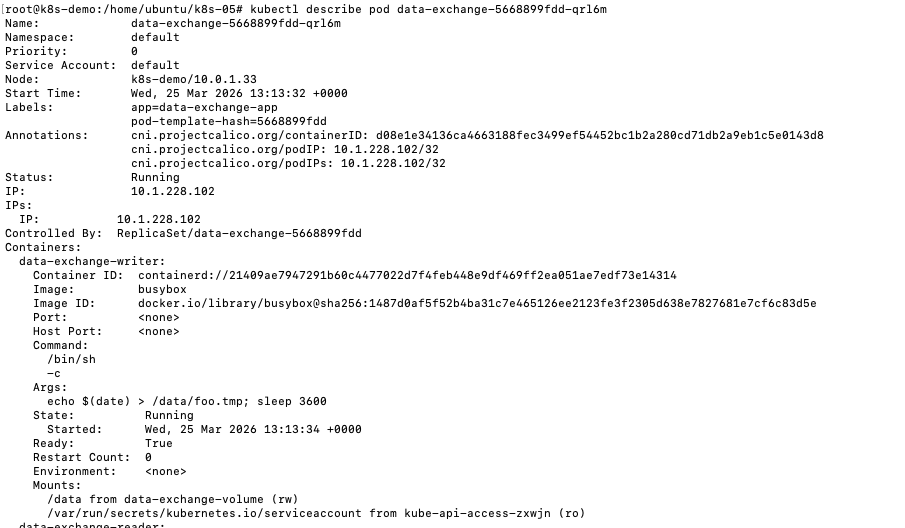
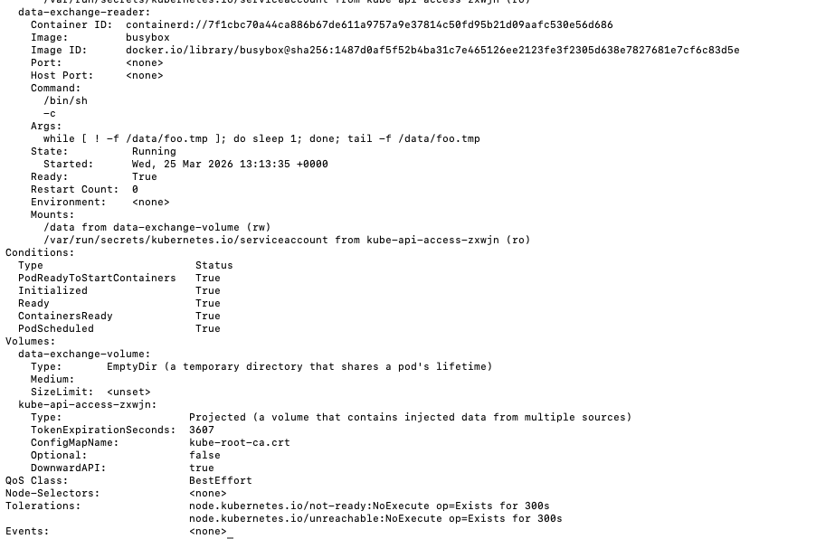
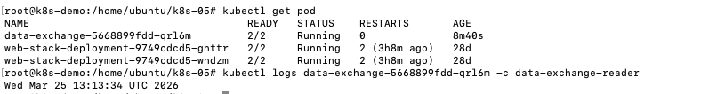
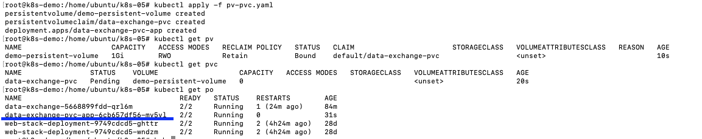
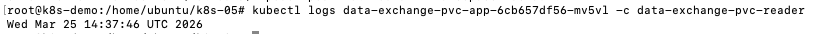
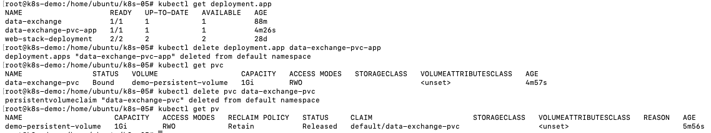
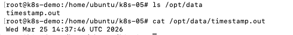
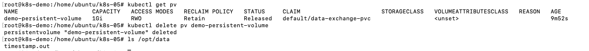
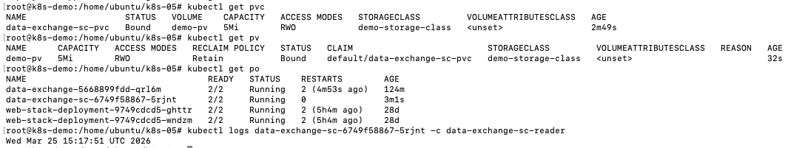

# Задача 1

# Задача 2

После удаления deplyment и pvc, pv остался на ноде, т.к. pv не относится к pod, а создается для node.

файл остался на диске

После удаления pv файл остался, потому что установлена политика retain

# Задача 3

