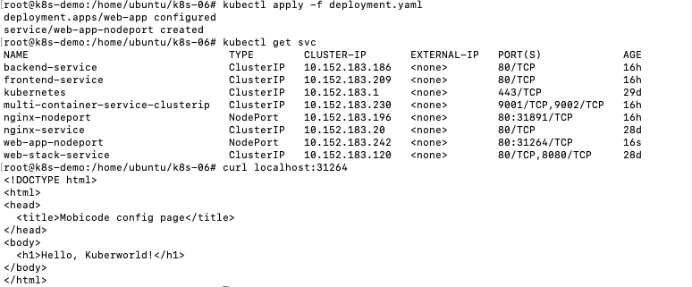
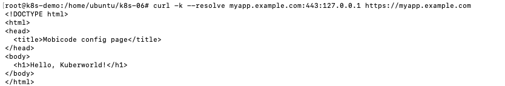
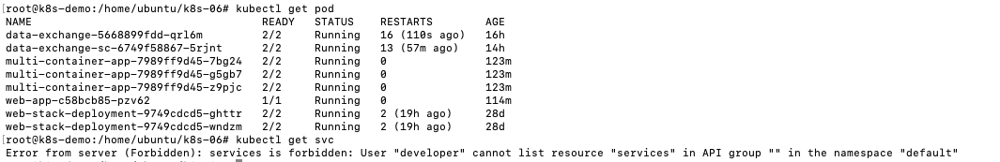

# Задача 1



# Задача 2

Для генерации навтроек Secret удобно использовать
```bash
echo "apiVersion: v1
kind: Secret
metadata:
  name: web-app-secret-tls
type: kubernetes.io/tls
data:
  tls.crt: $(base64 -w 0 tls.crt)
  tls.key: $(base64 -w 0 tls.key)"
```
curl -k --resolve myapp.example.com:443:127.0.0.1 https://myapp.example.com



# Задача 3

Настройка сертификата для пользователя **developer** 

```bash
root@k8s-demo:/home/ubuntu/k8s-06# openssl genrsa -out developer.key 2048
root@k8s-demo:/home/ubuntu/k8s-06# openssl req -new -key developer.key -out developer.csr -subj "/CN=developer/O=devops"
root@k8s-demo:/home/ubuntu/k8s-06# nano ~/.kube/config 
root@k8s-demo:/home/ubuntu/k8s-06# cp /var/snap/microk8s/current/certs/ca.crt .
root@k8s-demo:/home/ubuntu/k8s-06# cp /var/snap/microk8s/current/certs/ca.key .

root@k8s-demo:/home/ubuntu/k8s-06# openssl x509 -req -in developer.csr -CA ca.crt -CAkey ca.key -CAcreateserial -out developer.crt -days 365
Certificate request self-signature ok
subject=CN = developer, O = devops
```

Добавление пользователя в config

```bash
kubectl config set-credentials developer --client-certificate=developer.crt --client-key=developer.key --embed-certs=true
kubectl config set-context developer --cluster=microk8s-cluster --user=developer
kubectl config use-context developer
```

