# Задача 1

Создаем отдельный namespace для **demo-app**

```bash
kubectl create ns demo-app
```

```bash
helm template .
```

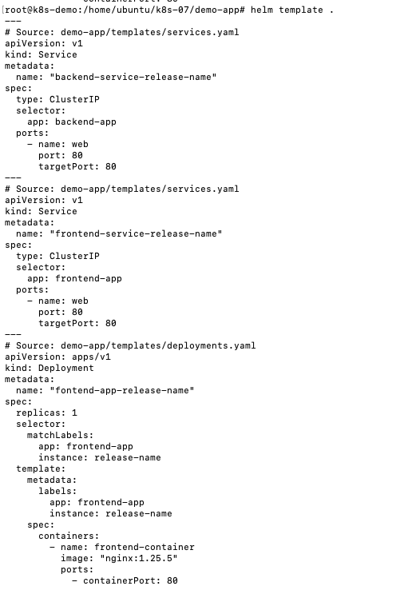

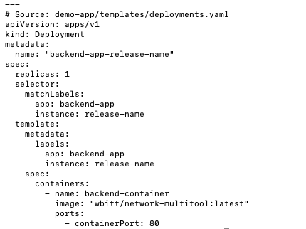

```bash
helm upgrade -i demo-app-dev . -n demo-app
```

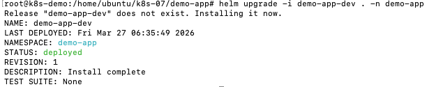

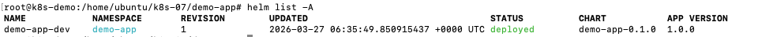

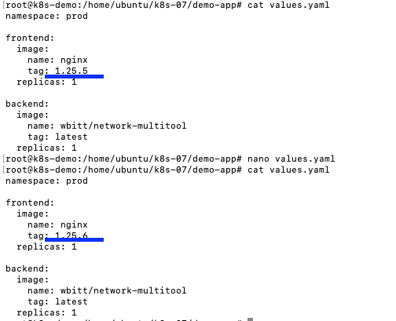

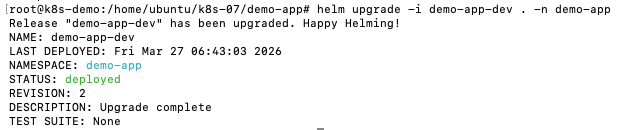

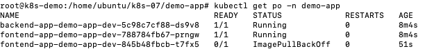

контейнер не создался т.к. нет такого образа

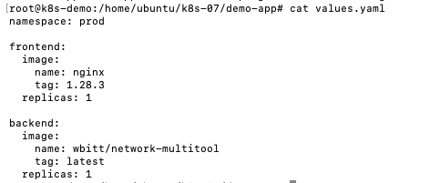

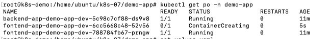

после скачивания образа остается новый контейнер для frontend. контейр для backend не поменялся

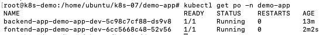

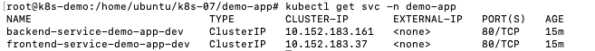

# Задача 2

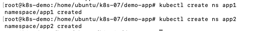

запускаем dev и prod с переопределенными параметрами в app1

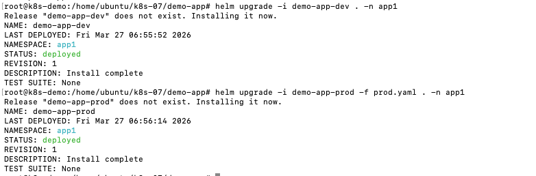

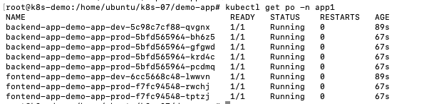

запускаем dev в app2

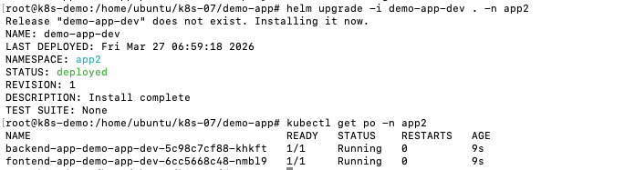

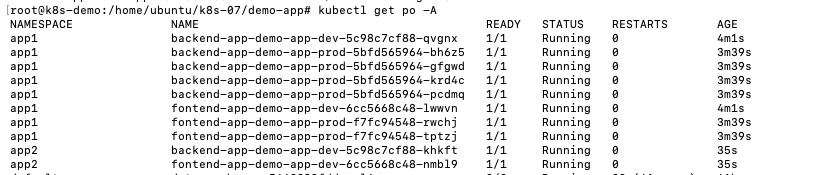