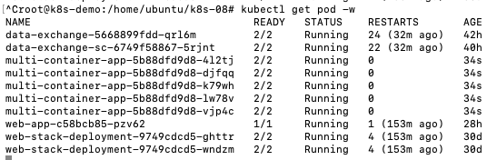
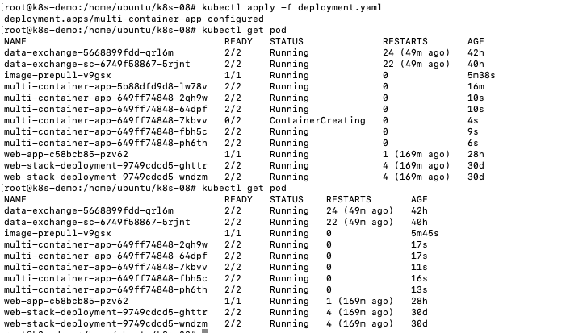
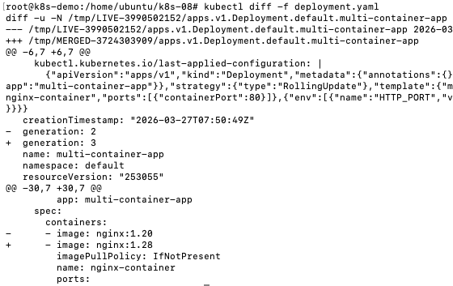
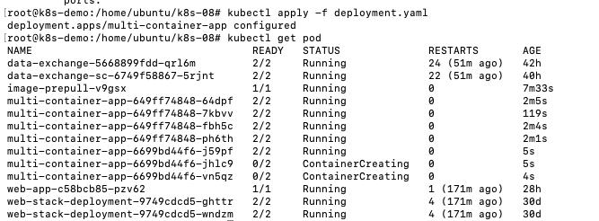
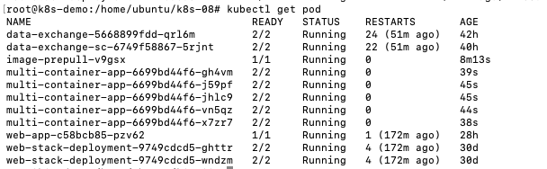
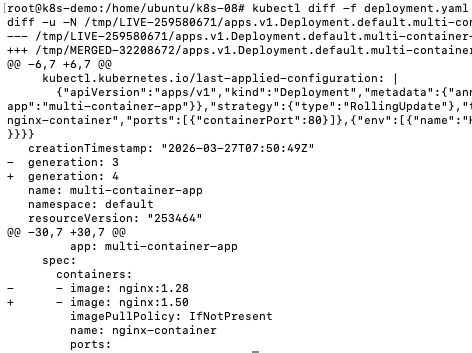
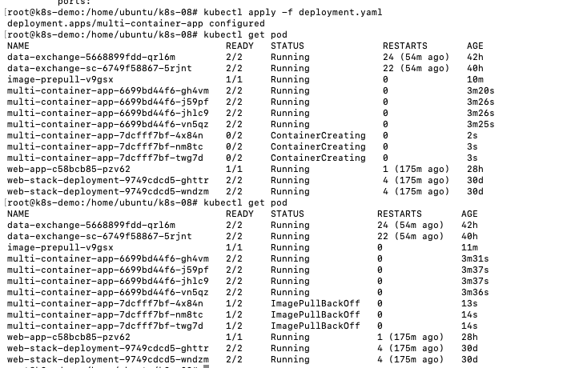
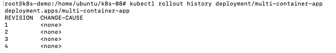
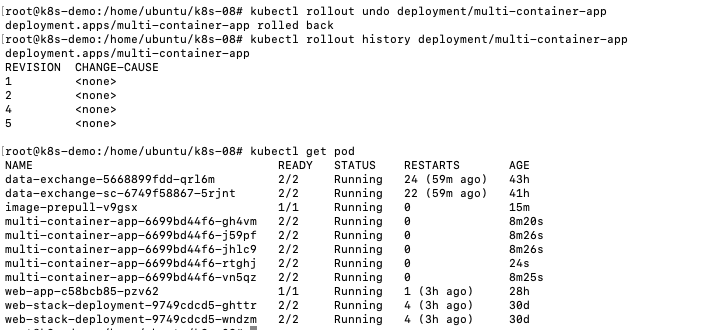

# Задание 1

Rolling Update — Не подходит<br>
- в переходный период одновременно работают старая и новая версии. Из-за несовместимости это вызовет ошибки при взаимодействии реплик.

Blue/Green — Не подходит<br>
- требует удвоения ресурсов, которых нет.

Canary — Не подходит<br>
- несовместимые версии работают параллельно.
- требует удвоения ресурсов, которых нет.

Recrate - **Подходит**<br>
- полная замена версии 1 на версию 2
- не требует доп. ресурсов, т.к. сначала удаляется версия 1, а потом создается версия 2
- простое обновление

Из минусов - downtime, поэтому лучше:
- Выбрать время с минимальной нагрузкой для обновления
- заранее подготовить образы и загрузить из на ноды
- уведомить пользователей, чтобы будет простой системы
- подготовить план возврата, если будут проблемы с версией 2

# Задача 2



загружаем image nginx:1.20 на все ноды

``` bash
kubectl apply -f image-pull.yaml 
kubectl rollout status daemonset/image-prepull
kubectl delete daemonset image-prepull
```
запускаем deployment с версией 1.20



обновляем жо версии 1.28







обновление прошло успешно, т.к. уже выпустили версию 1.28, пробуем обновиться на 1.50





обновление прошло с ошибкой, т.к. нет образа



