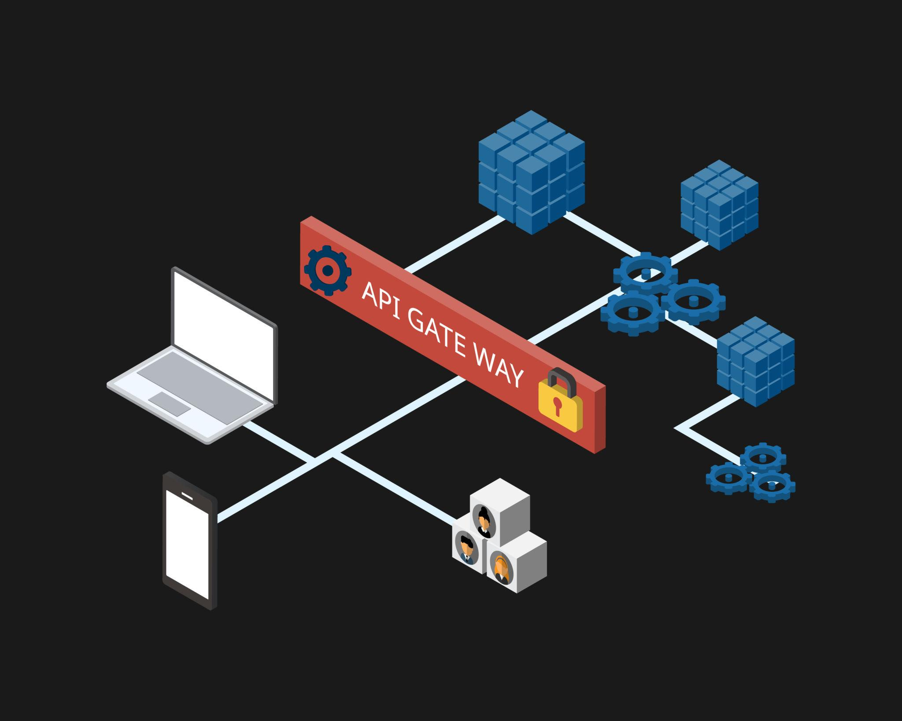

# Задача №1

Предложите решение для обеспечения реализации API Gateway. Составьте сравнительную таблицу возможностей различных программных решений. На основе таблицы сделайте выбор решения.

Решение должно соответствовать следующим требованиям:

* маршрутизация запросов к нужному сервису на основе конфигурации,
* возможность проверки аутентификационной информации в запросах,
* обеспечение терминации HTTPS.

Обоснуйте свой выбор.

## Предлагаемое решение API Gateway (целевое)
### Архитектура (обобщённо)

### Компоненты:

* API Gateway (edge-слой)
* Клиенты (Web / Mobile / внешние системы)
* Backend-сервисы (микросервисы)
* Identity Provider (OIDC / OAuth2)
* Observability (logs / metrics / tracing)

### Функции Gateway:

* маршрутизация запросов по конфигурации;
* аутентификация и авторизация (JWT/OIDC/API key);
* TLS termination (HTTPS);
* rate limiting, quota, basic security;
* централизованная точка входа.

| Критерий                      | **Kong Gateway**                             | **NGINX (Ingress / Plus)**     | **Tyk Gateway**              |
| ----------------------------- | -------------------------------------------- | ------------------------------ | ---------------------------- |
| Тип решения                   | Полноценный API Gateway                      | Reverse proxy / Ingress        | API Gateway + API Management |
| Маршрутизация по конфигурации | ✅ Service + Route (host/path/method/headers) | ✅ `location` / Ingress rules   | ✅ API Definition             |
| Declarative config / GitOps   | ✅ Да                                         | ⚠ Частично (Ingress YAML)      | ✅ Да                         |
| JWT / OIDC аутентификация     | ✅ Плагины из коробки                         | ⚠ Plus / отдельный auth-сервис | ✅ Из коробки                 |
| API key / consumer model      | ✅ Да                                         | ⚠ Через модули/скрипты         | ✅ Да                         |
| Политики доступа              | ✅ Через плагины                              | ❌ Ограничено                   | ✅ Сильная сторона            |
| Rate limiting / quotas        | ✅ Плагины                                    | ⚠ Частично                     | ✅ Да                         |
| TLS termination (HTTPS)       | ✅ Да                                         | ✅ Да (сильная сторона)         | ✅ Да                         |
| Kubernetes-native             | ✅ Да                                         | ✅ Отлично                      | ✅ Да                         |
| Масштабирование               | ✅ Горизонтальное                             | ✅ Очень высокое                | ✅ Горизонтальное             |
| Экосистема / расширяемость    | ✅ Очень большая                              | ⚠ Ограничена                   | ⚠ Меньше                     |
| Сложность внедрения           | Средняя                                      | Низкая → Средняя               | Средняя                      |
| Основной фокус                | Gateway + плагины                            | L7 proxy                       | API management               |

## Выбранное решение

**Kong Gateway**

* полноценный API Gateway;
* гибкая маршрутизация;
* зрелая модель плагинов (JWT, OIDC, rate limit, logging);
* хорошо ложится в Kubernetes и GitOps;
* можно начать с Open Source и масштабироваться.

# Задача №2

Составьте таблицу возможностей различных брокеров сообщений. На основе таблицы сделайте обоснованный выбор решения.

Решение должно соответствовать следующим требованиям:

* поддержка кластеризации для обеспечения надёжности,
* хранение сообщений на диске в процессе доставки,
* высокая скорость работы,
* поддержка различных форматов сообщений,
* разделение прав доступа к различным потокам сообщений,
* простота эксплуатации.

Обоснуйте свой выбор.

## Сравнительная таблица

| Критерий              | RabbitMQ                         | Apache Kafka               | NATS JetStream              | Apache Pulsar                         |
|-----------------------|----------------------------------|----------------------------|-----------------------------|---------------------------------------|
| Кластеризация         | Да (Quorum Queues)               | Да (Native)                | Да (Raft)                   | Да (Разделение слоев)                 |
| Хранение на диске     | Да (Persistent)                  | Да (Log-based)             | Да (JetStream)              | Да (BookKeeper)                       |
| Скорость (Performance)| Средняя (50k–100k/s)             | Очень высокая (1M+/s)      | Высокая (200k–500k/s)       | Очень высокая (1M+/s)                 |
| Форматы сообщений     | Любые (binary)                   | Любые (binary)             | Любые (binary)              | Любые (binary)                        |
| ACL / Права доступа   | Гибкие (VHosts, Regex)           | Сильные (ACLs)             | Отличные (Accounts/JWT)     | Отличные (Multi-tenancy)              |
| Простота эксплуатации | Высокая                          | Низкая (требует опыта)     | Очень высокая               | Очень низкая (сложная архитектура)    |

## Выбранное решение
**NATS JetStream**

* Простота эксплуатации (Ключевой фактор): В отличие от Kafka или Pulsar, NATS — это один бинарный файл. Ему не нужны внешние зависимости вроде ZooKeeper или JVM. Настройка кластера и управление им интуитивно понятны, что резко снижает TCO (стоимость владения).

* Высокая скорость: NATS написан на Go и ориентирован на минимальные задержки (latency). JetStream добавляет персистентность, сохраняя при этом производительность, значительно превышающую RabbitMQ, и приближающуюся к Kafka на стандартных нагрузках.

* Надёжность и кластеризация: Использование алгоритма консенсуса Raft для управления метаданными и репликации потоков (Streams) гарантирует, что сообщения не пропадут при выходе узлов из строя.

* Разделение прав доступа: NATS обладает одной из самых продвинутых моделей безопасности на основе Accounts и NKeys/JWT. Это позволяет изолировать потоки данных между разными командами или сервисами на уровне протокола.

* Хранение и форматы: JetStream позволяет хранить сообщения на диске с настраиваемой политикой удержания (retention). Как и конкуренты, он не накладывает ограничений на формат (можно передавать JSON, Protobuf, Avro или сырые байты).

### Альтернативные решения

**RabbitMQ**: Если нужна сложная маршрутизация сообщений (Exchange/Binding) и не планируется обрабатывать миллионы сообщений в секунду.

**Apache Kafka**: Если задача — построение огромного хранилища данных (Data Lake) или сложная аналитика в реальном времени, и есть выделенная команда DevOps для поддержки кластера.

# Задача №3

### Файлы конфигурации
* [docker-compose.yml](docker-compose.yml)
* [kong конфигурация](gateway/kong.yml)
* [kong token validation plugin](gateway/kong/plugins/token-validation/)

### Репозиторий для проверки
[github](https://github.com/sergei4/micros-homeworks/tree/main/11-microservices-02-principles)