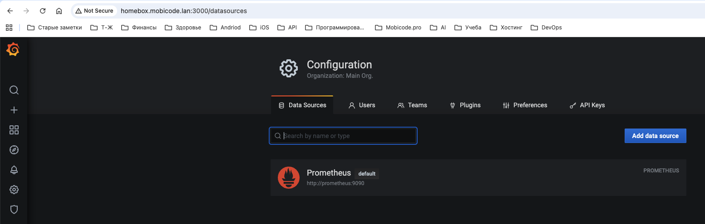
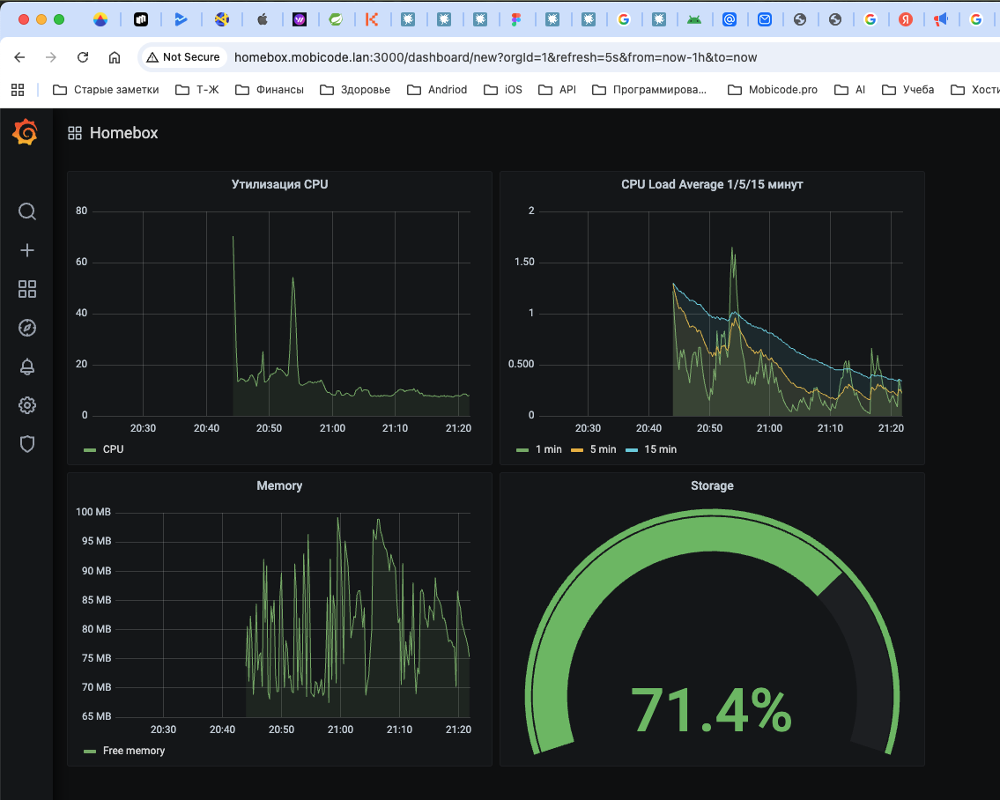
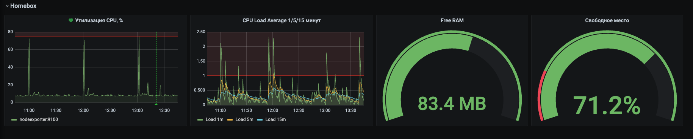

### Задание 1



### Задание 2



1. `100 - (avg by (instance) (rate(node_cpu_seconds_total{mode="idle", instance="nodeexporter:9100"}[1m])) * 100)`
2.
   * `node_load1{instance="nodeexporter:9100", job="nodeexporter"}`
   * `node_load5{instance="nodeexporter:9100", job="nodeexporter"}`
   * `node_load15{instance="nodeexporter:9100", job="nodeexporter"}`
3. `node_memory_MemFree_bytes {instance="nodeexporter:9100", job="nodeexporter"}`
4. `(node_filesystem_free_bytes{instance="nodeexporter:9100", job="nodeexporter", mountpoint="/"} / node_filesystem_size_bytes{instance="nodeexporter:9100", job="nodeexporter", mountpoint="/"}) * 100`

### Задание 3


### Задание 4
```json
{
  "annotations": {
    "list": [
      {
        "builtIn": 1,
        "datasource": "-- Grafana --",
        "enable": true,
        "hide": true,
        "iconColor": "rgba(0, 211, 255, 1)",
        "name": "Annotations & Alerts",
        "type": "dashboard"
      }
    ]
  },
  "editable": true,
  "gnetId": null,
  "graphTooltip": 0,
  "id": 1,
  "links": [],
  "panels": [
    {
      "collapsed": false,
      "datasource": null,
      "gridPos": {
        "h": 1,
        "w": 24,
        "x": 0,
        "y": 0
      },
      "id": 10,
      "panels": [],
      "title": "Macmini",
      "type": "row"
    },
    {
      "aliasColors": {},
      "bars": false,
      "dashLength": 10,
      "dashes": false,
      "datasource": null,
      "fieldConfig": {
        "defaults": {
          "custom": {}
        },
        "overrides": []
      },
      "fill": 1,
      "fillGradient": 0,
      "gridPos": {
        "h": 8,
        "w": 6,
        "x": 0,
        "y": 1
      },
      "hiddenSeries": false,
      "id": 3,
      "legend": {
        "avg": false,
        "current": false,
        "max": false,
        "min": false,
        "show": true,
        "total": false,
        "values": false
      },
      "lines": true,
      "linewidth": 1,
      "nullPointMode": "null",
      "options": {
        "alertThreshold": true
      },
      "percentage": false,
      "pluginVersion": "7.4.0",
      "pointradius": 2,
      "points": false,
      "renderer": "flot",
      "seriesOverrides": [],
      "spaceLength": 10,
      "stack": false,
      "steppedLine": false,
      "targets": [
        {
          "expr": "100 - (avg by (instance) (rate(node_cpu_seconds_total{mode=\"idle\", instance=\"192.168.10.107:9100\"}[1m])) * 100)",
          "hide": false,
          "interval": "",
          "legendFormat": "{{instance}}",
          "refId": "A"
        }
      ],
      "thresholds": [],
      "timeFrom": null,
      "timeRegions": [],
      "timeShift": null,
      "title": "Утилизация CPU, %",
      "tooltip": {
        "shared": true,
        "sort": 0,
        "value_type": "individual"
      },
      "type": "graph",
      "xaxis": {
        "buckets": null,
        "mode": "time",
        "name": null,
        "show": true,
        "values": []
      },
      "yaxes": [
        {
          "$$hashKey": "object:53",
          "format": "short",
          "label": null,
          "logBase": 1,
          "max": null,
          "min": null,
          "show": true
        },
        {
          "$$hashKey": "object:54",
          "format": "short",
          "label": null,
          "logBase": 1,
          "max": null,
          "min": null,
          "show": true
        }
      ],
      "yaxis": {
        "align": false,
        "alignLevel": null
      }
    },
    {
      "aliasColors": {},
      "bars": false,
      "dashLength": 10,
      "dashes": false,
      "datasource": null,
      "fieldConfig": {
        "defaults": {
          "custom": {}
        },
        "overrides": []
      },
      "fill": 1,
      "fillGradient": 0,
      "gridPos": {
        "h": 8,
        "w": 6,
        "x": 6,
        "y": 1
      },
      "hiddenSeries": false,
      "id": 6,
      "legend": {
        "avg": false,
        "current": false,
        "max": false,
        "min": false,
        "show": true,
        "total": false,
        "values": false
      },
      "lines": true,
      "linewidth": 1,
      "nullPointMode": "null",
      "options": {
        "alertThreshold": true
      },
      "percentage": false,
      "pluginVersion": "7.4.0",
      "pointradius": 2,
      "points": false,
      "renderer": "flot",
      "seriesOverrides": [],
      "spaceLength": 10,
      "stack": false,
      "steppedLine": false,
      "targets": [
        {
          "expr": "node_load1{instance=\"192.168.10.107:9100\", job=\"nodeexporter\"}",
          "interval": "",
          "legendFormat": "Load 1m",
          "refId": "A"
        },
        {
          "expr": "node_load5{instance=\"192.168.10.107:9100\", job=\"nodeexporter\"}",
          "hide": false,
          "interval": "",
          "legendFormat": "Load 5m",
          "refId": "B"
        },
        {
          "expr": "node_load15{instance=\"192.168.10.107:9100\", job=\"nodeexporter\"}",
          "hide": false,
          "interval": "",
          "legendFormat": "Load 15m",
          "refId": "C"
        }
      ],
      "thresholds": [],
      "timeFrom": null,
      "timeRegions": [],
      "timeShift": null,
      "title": "CPU Load Average 1/5/15 минут",
      "tooltip": {
        "shared": true,
        "sort": 0,
        "value_type": "individual"
      },
      "type": "graph",
      "xaxis": {
        "buckets": null,
        "mode": "time",
        "name": null,
        "show": true,
        "values": []
      },
      "yaxes": [
        {
          "$$hashKey": "object:171",
          "format": "short",
          "label": null,
          "logBase": 1,
          "max": null,
          "min": null,
          "show": true
        },
        {
          "$$hashKey": "object:172",
          "format": "short",
          "label": null,
          "logBase": 1,
          "max": null,
          "min": null,
          "show": true
        }
      ],
      "yaxis": {
        "align": false,
        "alignLevel": null
      }
    },
    {
      "datasource": null,
      "fieldConfig": {
        "defaults": {
          "color": {
            "mode": "thresholds"
          },
          "custom": {},
          "mappings": [],
          "thresholds": {
            "mode": "absolute",
            "steps": [
              {
                "color": "green",
                "value": null
              },
              {
                "color": "red",
                "value": 80
              }
            ]
          },
          "unit": "decbytes"
        },
        "overrides": []
      },
      "gridPos": {
        "h": 8,
        "w": 5,
        "x": 12,
        "y": 1
      },
      "id": 12,
      "options": {
        "reduceOptions": {
          "calcs": [
            "lastNotNull"
          ],
          "fields": "",
          "values": false
        },
        "showThresholdLabels": false,
        "showThresholdMarkers": true,
        "text": {}
      },
      "pluginVersion": "7.4.0",
      "targets": [
        {
          "expr": "node_memory_MemFree_bytes {instance=\"192.168.10.107:9100\", job=\"nodeexporter\"}",
          "interval": "",
          "legendFormat": "",
          "refId": "A"
        }
      ],
      "title": "Free RAM",
      "type": "gauge"
    },
    {
      "datasource": null,
      "fieldConfig": {
        "defaults": {
          "color": {
            "mode": "thresholds"
          },
          "custom": {},
          "mappings": [],
          "thresholds": {
            "mode": "absolute",
            "steps": [
              {
                "color": "green",
                "value": null
              },
              {
                "color": "red",
                "value": 80
              }
            ]
          },
          "unit": "percent"
        },
        "overrides": []
      },
      "gridPos": {
        "h": 8,
        "w": 5,
        "x": 17,
        "y": 1
      },
      "id": 16,
      "options": {
        "reduceOptions": {
          "calcs": [
            "lastNotNull"
          ],
          "fields": "",
          "values": false
        },
        "showThresholdLabels": false,
        "showThresholdMarkers": true,
        "text": {}
      },
      "pluginVersion": "7.4.0",
      "targets": [
        {
          "expr": "(node_filesystem_free_bytes{instance=\"192.168.10.107:9100\", job=\"nodeexporter\", mountpoint=\"/\"} / node_filesystem_size_bytes{instance=\"192.168.10.107:9100\", job=\"nodeexporter\", mountpoint=\"/\"}) * 100",
          "interval": "",
          "legendFormat": "",
          "refId": "A"
        }
      ],
      "title": "Свободное место",
      "type": "gauge"
    },
    {
      "collapsed": false,
      "datasource": null,
      "gridPos": {
        "h": 1,
        "w": 24,
        "x": 0,
        "y": 9
      },
      "id": 8,
      "panels": [],
      "title": "Homebox",
      "type": "row"
    },
    {
      "alert": {
        "alertRuleTags": {},
        "conditions": [
          {
            "evaluator": {
              "params": [
                75
              ],
              "type": "gt"
            },
            "operator": {
              "type": "and"
            },
            "query": {
              "params": [
                "A",
                "5m",
                "now"
              ]
            },
            "reducer": {
              "params": [],
              "type": "last"
            },
            "type": "query"
          }
        ],
        "executionErrorState": "alerting",
        "for": "5m",
        "frequency": "1m",
        "handler": 1,
        "name": "Утилизация CPU, % alert",
        "noDataState": "no_data",
        "notifications": [
          {
            "uid": "7XrDiQ4vz"
          }
        ]
      },
      "aliasColors": {},
      "bars": false,
      "dashLength": 10,
      "dashes": false,
      "datasource": null,
      "fieldConfig": {
        "defaults": {
          "custom": {}
        },
        "overrides": []
      },
      "fill": 1,
      "fillGradient": 0,
      "gridPos": {
        "h": 8,
        "w": 6,
        "x": 0,
        "y": 10
      },
      "hiddenSeries": false,
      "id": 2,
      "legend": {
        "avg": false,
        "current": false,
        "max": false,
        "min": false,
        "show": true,
        "total": false,
        "values": false
      },
      "lines": true,
      "linewidth": 1,
      "nullPointMode": "null",
      "options": {
        "alertThreshold": true
      },
      "percentage": false,
      "pluginVersion": "7.4.0",
      "pointradius": 2,
      "points": false,
      "renderer": "flot",
      "seriesOverrides": [],
      "spaceLength": 10,
      "stack": false,
      "steppedLine": false,
      "targets": [
        {
          "expr": "100 - (avg by (instance) (rate(node_cpu_seconds_total{mode=\"idle\", instance=\"nodeexporter:9100\"}[1m])) * 100)",
          "hide": false,
          "interval": "",
          "legendFormat": "{{instance}}",
          "refId": "A"
        }
      ],
      "thresholds": [
        {
          "colorMode": "critical",
          "fill": true,
          "line": true,
          "op": "gt",
          "value": 75,
          "visible": true
        }
      ],
      "timeFrom": null,
      "timeRegions": [],
      "timeShift": null,
      "title": "Утилизация CPU, %",
      "tooltip": {
        "shared": true,
        "sort": 0,
        "value_type": "individual"
      },
      "type": "graph",
      "xaxis": {
        "buckets": null,
        "mode": "time",
        "name": null,
        "show": true,
        "values": []
      },
      "yaxes": [
        {
          "$$hashKey": "object:53",
          "format": "short",
          "label": null,
          "logBase": 1,
          "max": null,
          "min": null,
          "show": true
        },
        {
          "$$hashKey": "object:54",
          "format": "short",
          "label": null,
          "logBase": 1,
          "max": null,
          "min": null,
          "show": true
        }
      ],
      "yaxis": {
        "align": false,
        "alignLevel": null
      }
    },
    {
      "alert": {
        "alertRuleTags": {},
        "conditions": [
          {
            "evaluator": {
              "params": [
                1
              ],
              "type": "gt"
            },
            "operator": {
              "type": "and"
            },
            "query": {
              "params": [
                "C",
                "5m",
                "now"
              ]
            },
            "reducer": {
              "params": [],
              "type": "last"
            },
            "type": "query"
          }
        ],
        "executionErrorState": "alerting",
        "for": "5m",
        "frequency": "1m",
        "handler": 1,
        "name": "CPU Load Average 1/5/15 минут alert",
        "noDataState": "no_data",
        "notifications": [
          {
            "uid": "7XrDiQ4vz"
          }
        ]
      },
      "aliasColors": {},
      "bars": false,
      "dashLength": 10,
      "dashes": false,
      "datasource": null,
      "fieldConfig": {
        "defaults": {
          "custom": {}
        },
        "overrides": []
      },
      "fill": 1,
      "fillGradient": 0,
      "gridPos": {
        "h": 8,
        "w": 6,
        "x": 6,
        "y": 10
      },
      "hiddenSeries": false,
      "id": 5,
      "legend": {
        "avg": false,
        "current": false,
        "max": false,
        "min": false,
        "show": true,
        "total": false,
        "values": false
      },
      "lines": true,
      "linewidth": 1,
      "nullPointMode": "null",
      "options": {
        "alertThreshold": true
      },
      "percentage": false,
      "pluginVersion": "7.4.0",
      "pointradius": 2,
      "points": false,
      "renderer": "flot",
      "seriesOverrides": [],
      "spaceLength": 10,
      "stack": false,
      "steppedLine": false,
      "targets": [
        {
          "expr": "node_load1{instance=\"nodeexporter:9100\", job=\"nodeexporter\"}",
          "interval": "",
          "legendFormat": "Load 1m",
          "refId": "A"
        },
        {
          "expr": "node_load5{instance=\"nodeexporter:9100\", job=\"nodeexporter\"}",
          "hide": false,
          "interval": "",
          "legendFormat": "Load 5m",
          "refId": "B"
        },
        {
          "expr": "node_load15{instance=\"nodeexporter:9100\", job=\"nodeexporter\"}",
          "hide": false,
          "interval": "",
          "legendFormat": "Load 15m",
          "refId": "C"
        }
      ],
      "thresholds": [
        {
          "colorMode": "critical",
          "fill": true,
          "line": true,
          "op": "gt",
          "value": 1,
          "visible": true
        }
      ],
      "timeFrom": null,
      "timeRegions": [],
      "timeShift": null,
      "title": "CPU Load Average 1/5/15 минут",
      "tooltip": {
        "shared": true,
        "sort": 0,
        "value_type": "individual"
      },
      "type": "graph",
      "xaxis": {
        "buckets": null,
        "mode": "time",
        "name": null,
        "show": true,
        "values": []
      },
      "yaxes": [
        {
          "$$hashKey": "object:171",
          "format": "short",
          "label": null,
          "logBase": 1,
          "max": null,
          "min": null,
          "show": true
        },
        {
          "$$hashKey": "object:172",
          "format": "short",
          "label": null,
          "logBase": 1,
          "max": null,
          "min": null,
          "show": true
        }
      ],
      "yaxis": {
        "align": false,
        "alignLevel": null
      }
    },
    {
      "datasource": null,
      "fieldConfig": {
        "defaults": {
          "color": {
            "mode": "thresholds"
          },
          "custom": {},
          "mappings": [],
          "min": 0,
          "thresholds": {
            "mode": "absolute",
            "steps": [
              {
                "color": "green",
                "value": null
              }
            ]
          },
          "unit": "decbytes"
        },
        "overrides": []
      },
      "gridPos": {
        "h": 8,
        "w": 5,
        "x": 12,
        "y": 10
      },
      "id": 13,
      "maxDataPoints": null,
      "options": {
        "reduceOptions": {
          "calcs": [
            "lastNotNull"
          ],
          "fields": "",
          "values": false
        },
        "showThresholdLabels": false,
        "showThresholdMarkers": true,
        "text": {}
      },
      "pluginVersion": "7.4.0",
      "targets": [
        {
          "expr": "node_memory_MemFree_bytes {instance=\"nodeexporter:9100\", job=\"nodeexporter\"}",
          "interval": "",
          "legendFormat": "",
          "refId": "A"
        }
      ],
      "title": "Free RAM",
      "type": "gauge"
    },
    {
      "datasource": null,
      "fieldConfig": {
        "defaults": {
          "color": {
            "mode": "thresholds"
          },
          "custom": {},
          "mappings": [],
          "thresholds": {
            "mode": "percentage",
            "steps": [
              {
                "color": "red",
                "value": null
              },
              {
                "color": "green",
                "value": 20
              }
            ]
          },
          "unit": "percent"
        },
        "overrides": []
      },
      "gridPos": {
        "h": 8,
        "w": 5,
        "x": 17,
        "y": 10
      },
      "id": 15,
      "options": {
        "reduceOptions": {
          "calcs": [
            "lastNotNull"
          ],
          "fields": "",
          "values": false
        },
        "showThresholdLabels": false,
        "showThresholdMarkers": true,
        "text": {}
      },
      "pluginVersion": "7.4.0",
      "targets": [
        {
          "expr": "(node_filesystem_free_bytes{instance=\"nodeexporter:9100\", job=\"nodeexporter\", mountpoint=\"/\"} / node_filesystem_size_bytes{instance=\"nodeexporter:9100\", job=\"nodeexporter\", mountpoint=\"/\"}) * 100",
          "interval": "",
          "legendFormat": "",
          "refId": "A"
        }
      ],
      "title": "Свободное место",
      "type": "gauge"
    }
  ],
  "refresh": false,
  "schemaVersion": 27,
  "style": "dark",
  "tags": [],
  "templating": {
    "list": []
  },
  "time": {
    "from": "now-6h",
    "to": "now"
  },
  "timepicker": {},
  "timezone": "",
  "title": "Homebox",
  "uid": "A1fYlaVvz",
  "version": 11
}
```