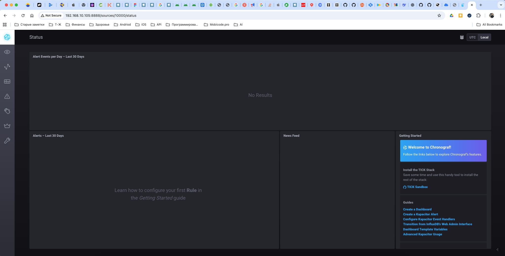
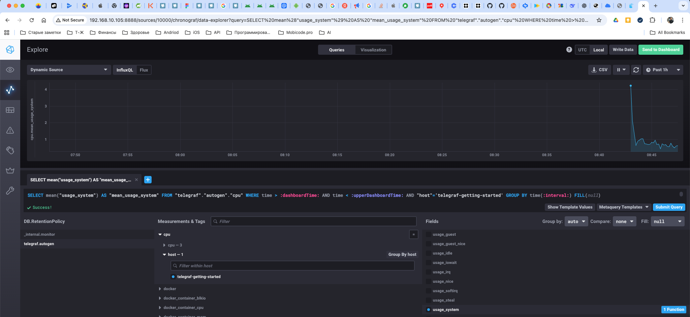
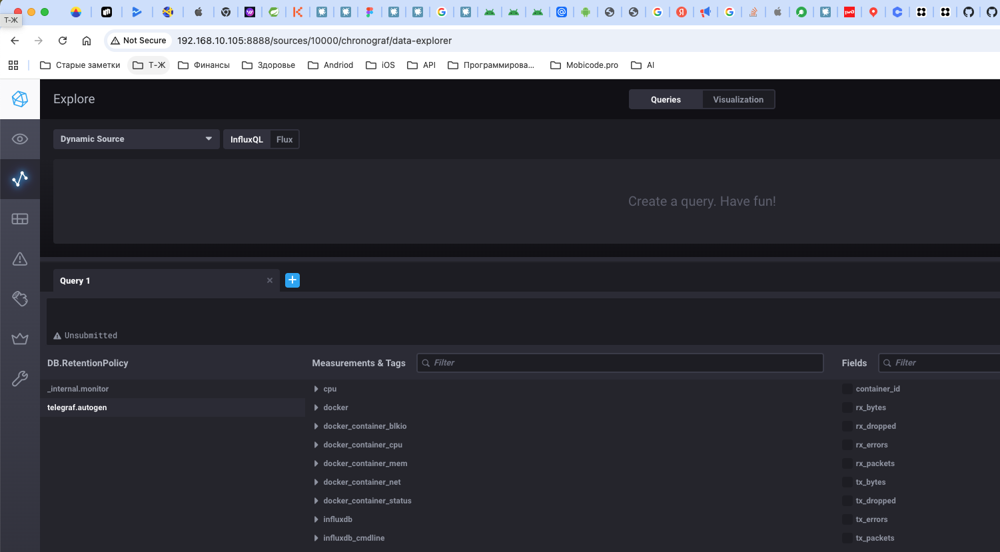

### Вопрос 1:

* CPU usage (%) - перегрузка напрямую влияет на время ответа, даст возможность понять когда нужно добавлять CPU
* RAM usage, RAM available - для отслеживания ООМ
* Disk usage (%) - чтобы понимать, когда закончится место и добавить при необходимости
* Disk IO (read/write) - может влиять на выдачу отчетов, если будет долгое время записи
* Inodes usage - большое количество файлов может закончить inodes раньше места
* RPS (requests per second) - для мониторинга активности системы
* HTTP response codes (2xx/4xx/5xx) - для понимания, сколько упешных и ошибочных запросов
* HTTP latency (p95/p99) - критично для понимания пользовательского опыта и скорости получения ответов

### Вопрос 2:

Менеджеру важны ценность для клиента и качество сервиса, а не технические детали.

Поэтому переводим метрики на язык бизнеса SLI / SLO / SLA
* Доступность сервиса (%)
* Успешные запросы (%)
* Время ответа (например, 95% запросов < 500 мс)

Например:

* «99.2% запросов обработано успешно»
* «Среднее время формирования отчёта — 1.3 сек»
* «Сервис был недоступен 4 минуты за месяц»

* Показываем в виде статусов для удобного восприятия: Зелёный / жёлтый / красный статус

* Показываем тренды: «стало лучше / хуже»

Технические метрики остаются для DevOps, бизнесу показывается результат работы системы для клиента.

### Вопрос 3:

Оптимальное решение — использовать SaaS-сервисы с бесплатными тарифами:

* Sentry: Специализируется на сборе ошибок из приложений с богатым контекстом (стектрейс, переменные, пользователь). Имеет очень щедрый free-план.
* LogTail, Better Stack, Datadog (ограниченный free): Позволяют централизованно собирать и искать логи.
* Grafana Cloud (Free tier): Включает Loki для логов и Grafana для визуализации. Бесплатно до 10 ГБ логов в месяц.

 Предложить разработчикам интегрировать Sentry SDK в приложение. Это даст им максимально детализированную информацию об ошибках сразу, без необходимости парсить raw-логи. Это стандартный и эффективный подход

 ### Вопрос 4:

```
 SLA = sum_2xx_requests / sum_all_requests
```
1. В sum_all_requests попадают не только HTTP-запросы

Например:
* health-checks
* метрики
* websocket
* внутренние запросы

2. Есть 3xx ответы

302, 304 — не 2xx, но и не 4xx/5xx

Они попадают в all_requests, но не в 2xx

3. Асинхронные / оборванные запросы

* Клиент закрыл соединение
* Таймаут без кода ответа

### Вопрос 5:
Pull vs Push системы мониторинга

Pull (Вытягивание)

Плюсы:
1. Централизованное управление: Сервер решает, когда и что опрашивать.
2. Проще контролировать подлинность данных: Сервер сам ходит за ними.
3. Легко проверить работу мониторинга: Можно имитировать запрос от сервера (curl).
4. Натуральная балансировка: Сервер распределяет нагрузку опроса.

Минусы:
1. Требуется "белый IP" или доступ с сервера мониторинга до всех целей.
2. Нужно знать цели опроса заранее (или использовать service discovery).
3. Плохо для кратковременных задач (jobs): Если задача завершится между опросами, ее метрики можно потерять.

Push (Отправка)

Плюсы:
1. Гибкость отправителя: Агент/приложение само решает, когда и что отправлять.
2. Идеально для кратковременных задач: Задача отправляет метрики перед завершением.
3. Легче работать с NAT/Firewall: Исходящие соединения из DMZ обычно проще.
4. Меньше задержка получения метрики.

Минусы:
1. Риск потери данных при падении сервера сбора.
2. Сложнее контролировать подлинность и достоверность данных.
3. Риск DDoS сервера мониторинга со стороны сломанных агентов.
4. Нужно настраивать каждого агента.

### Вопрос 6:

| Система                        | Модель                            |
| ------------------------------ | --------------------------------- |
| **Prometheus**                 | Pull                              |
| **TICK (Telegraf + InfluxDB)** | Push                              |
| **Zabbix**                     | Гибрид (agent push + server pull) |
| **VictoriaMetrics**            | Гибрид                            |
| **Nagios**                     | Pull                              |

 ### Вопрос 7:

 

### Вопрос 7:



### Вопрос 8:

