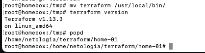
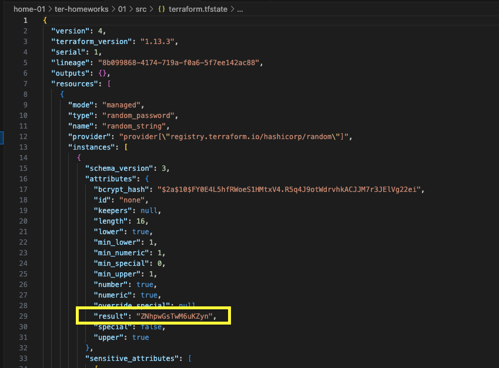
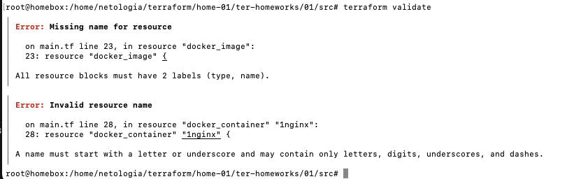
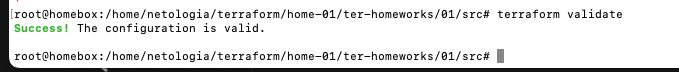
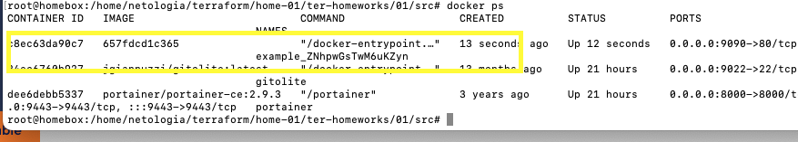
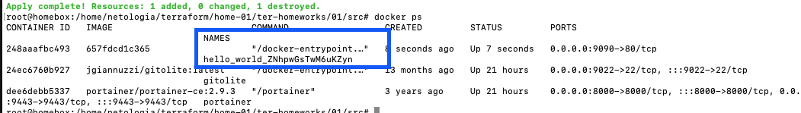
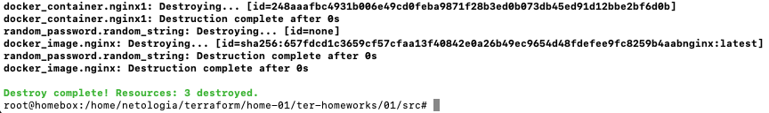
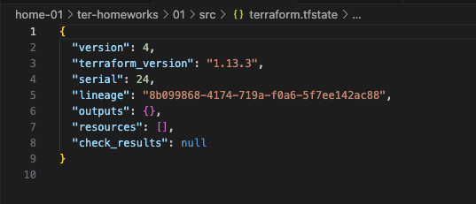
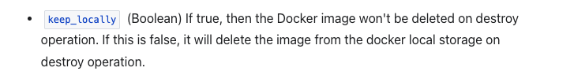
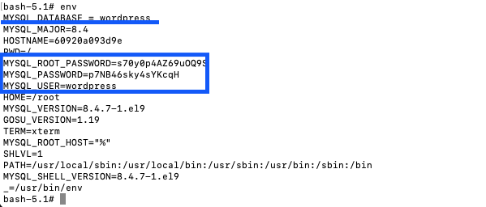

### Подготовка к выполнению



### Задание 1

* Сектерные данные можно записать в файл `personal.auto.tfvars` т.к. он добавлен в `.gitignore`

* Сгенерированный пароль 
 
  

* Ошибки 
   - не указано имя ресурса, требуется указать `nginx`
   - имя ресурса дожно начинаться с символа `1nginx` -> `nginx1`
   - некорректная ссылка на `ресурс, должно быть name  = "example_${random_password.random_string.result}"`





Первый запуск terraform apply



Запуск `terraform apply -auto-approve`



Запуск с ключом `-auto-approve` автоматически применяет конфигурацию. Запуск с этим ключом удобно выполнять на CI/CD или при создании Docker образа, где нет возможности вручную выполнить подтверждение.

* Удаление ресурсов





Образ не был удален, потому что в настройка ресурса указан параметр `keep_locally = true`



### Задание 2

```
terraform {
  required_providers {
    docker = {
      source  = "kreuzwerker/docker"
      version = "~> 3.0.1"
    }
  }
  required_version = ">=1.12.0" /*Многострочный комментарий.
 Требуемая версия terraform */
}

provider "docker" {
  host     = "ssh://ubuntu@158.160.201.142:22"
  ssh_opts = [
    "-o", "StrictHostKeyChecking=no", 
    "-o", "UserKnownHostsFile=/dev/null",
    "-o", "ConnectTimeout=60"
  ]
}
#однострочный комментарий

resource "random_password" "root_password" {
  length      = 16
  special     = false
  min_upper   = 1
  min_lower   = 1
  min_numeric = 1
}

resource "random_password" "user_password" {
  length      = 16
  special     = false
  min_upper   = 1
  min_lower   = 1
  min_numeric = 1
}

resource "docker_image" "mysql" {
  name         = "mysql:8"
  keep_locally = true
}

resource "docker_container" "wordpress_db" {
  image = docker_image.mysql.image_id
  name  = "wordpress_db"

  ports {
    internal = 3306
    external = 3306
  }

  env = [
    "MYSQL_ROOT_PASSWORD=${random_password.root_password.result}",
    "MYSQL_DATABASE = wordpress",
    "MYSQL_USER=wordpress",
    "MYSQL_PASSWORD=${random_password.user_password.result}",
    "MYSQL_ROOT_HOST=\"%\""
  ]

}
```

