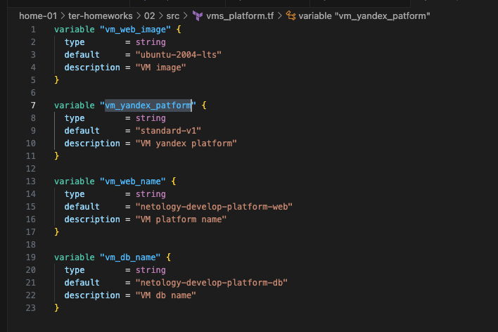

### Задание 1

`preemptible = true` и `core_fraction=5` позволяют экономить финансы ресурсы за счет того, что ВМ будет работать 24 часа и испоьзовать 5% процессорного времени

### Задание 2

### Задание 3

### Задание 4

### Задание 5

### Задание 6

Исходный код в папке src